# Agent Workflow Runtime status

> Generated deterministically from task front matter. Do not edit this file directly.
> Status records coordination progress; it is not evidence that product behavior is accepted.

## Portfolio overview

**99 ARs tracked** across 3 active status categories.

| Status | Meaning | Count |
| --- | --- | ---: |
| **In progress** | Claimed work with a live lease | 0 |
| **Open** | Dependency-ready and available to claim | 1 |
| **Blocked** | Cannot proceed until its recorded blocker clears | 0 |
| **Planned** | Defined work awaiting promotion or dependencies | 5 |
| **Future** | Deferred roadmap work | 0 |
| **Done** | Accepted, integrated, and durably verified | 93 |
| **Cancelled** | Stopped with a recorded rationale | 0 |
| **Superseded** | Replaced by another AR | 0 |

## Dependency graph

Arrows point from each prerequisite to the work that depends on it. Color is redundant
with the status text inside every node; the tables below are the complete text
alternative.

```mermaid
flowchart LR
    subgraph series_00["00 - Coordination foundation"]
        direction TB
        AR_0001["AR-0001 - Done"]:::status_done
        AR_0002["AR-0002 - Done"]:::status_done
        AR_0003["AR-0003 - Done"]:::status_done
        AR_0004["AR-0004 - Done"]:::status_done
        AR_0005["AR-0005 - Done"]:::status_done
        AR_0006["AR-0006 - Done"]:::status_done
        AR_0007["AR-0007 - Done"]:::status_done
        AR_0008["AR-0008 - Done"]:::status_done
        AR_0009["AR-0009 - Done"]:::status_done
        AR_0010["AR-0010 - Done"]:::status_done
        AR_0011["AR-0011 - Done"]:::status_done
        AR_0012["AR-0012 - Done"]:::status_done
        AR_0013["AR-0013 - Done"]:::status_done
        AR_0014["AR-0014 - Done"]:::status_done
        AR_0015["AR-0015 - Done"]:::status_done
        AR_0016["AR-0016 - Done"]:::status_done
        AR_0017["AR-0017 - Done"]:::status_done
        AR_0018["AR-0018 - Done"]:::status_done
        AR_0019["AR-0019 - Done"]:::status_done
        AR_0020["AR-0020 - Done"]:::status_done
        AR_0021["AR-0021 - Done"]:::status_done
        AR_0022["AR-0022 - Done"]:::status_done
        AR_0023["AR-0023 - Done"]:::status_done
        AR_0024["AR-0024 - Done"]:::status_done
        AR_0025["AR-0025 - Done"]:::status_done
        AR_0026["AR-0026 - Done"]:::status_done
        AR_0027["AR-0027 - Done"]:::status_done
        AR_0028["AR-0028 - Done"]:::status_done
        AR_0029["AR-0029 - Done"]:::status_done
        AR_0030["AR-0030 - Done"]:::status_done
        AR_0031["AR-0031 - Done"]:::status_done
        AR_0032["AR-0032 - Done"]:::status_done
        AR_0033["AR-0033 - Done"]:::status_done
        AR_0034["AR-0034 - Done"]:::status_done
        AR_0035["AR-0035 - Done"]:::status_done
        AR_0036["AR-0036 - Done"]:::status_done
        AR_0037["AR-0037 - Done"]:::status_done
        AR_0038["AR-0038 - Done"]:::status_done
        AR_0039["AR-0039 - Done"]:::status_done
        AR_0040["AR-0040 - Done"]:::status_done
        AR_0041["AR-0041 - Done"]:::status_done
        AR_0042["AR-0042 - Done"]:::status_done
        AR_0043["AR-0043 - Done"]:::status_done
        AR_0044["AR-0044 - Done"]:::status_done
        AR_0045["AR-0045 - Done"]:::status_done
        AR_0046["AR-0046 - Done"]:::status_done
        AR_0047["AR-0047 - Done"]:::status_done
        AR_0048["AR-0048 - Done"]:::status_done
        AR_0049["AR-0049 - Done"]:::status_done
        AR_0050["AR-0050 - Done"]:::status_done
        AR_0051["AR-0051 - Done"]:::status_done
        AR_0052["AR-0052 - Done"]:::status_done
        AR_0053["AR-0053 - Done"]:::status_done
        AR_0054["AR-0054 - Done"]:::status_done
        AR_0055["AR-0055 - Done"]:::status_done
        AR_0056["AR-0056 - Done"]:::status_done
        AR_0057["AR-0057 - Done"]:::status_done
        AR_0058["AR-0058 - Done"]:::status_done
        AR_0059["AR-0059 - Done"]:::status_done
        AR_0060["AR-0060 - Done"]:::status_done
        AR_0061["AR-0061 - Done"]:::status_done
        AR_0062["AR-0062 - Done"]:::status_done
        AR_0063["AR-0063 - Done"]:::status_done
        AR_0064["AR-0064 - Done"]:::status_done
        AR_0065["AR-0065 - Done"]:::status_done
        AR_0066["AR-0066 - Done"]:::status_done
        AR_0067["AR-0067 - Done"]:::status_done
        AR_0068["AR-0068 - Done"]:::status_done
        AR_0069["AR-0069 - Done"]:::status_done
        AR_0070["AR-0070 - Done"]:::status_done
        AR_0071["AR-0071 - Done"]:::status_done
        AR_0072["AR-0072 - Done"]:::status_done
        AR_0073["AR-0073 - Done"]:::status_done
        AR_0074["AR-0074 - Done"]:::status_done
        AR_0075["AR-0075 - Done"]:::status_done
        AR_0076["AR-0076 - Done"]:::status_done
        AR_0077["AR-0077 - Done"]:::status_done
        AR_0078["AR-0078 - Done"]:::status_done
        AR_0079["AR-0079 - Done"]:::status_done
        AR_0080["AR-0080 - Done"]:::status_done
        AR_0081["AR-0081 - Done"]:::status_done
        AR_0082["AR-0082 - Done"]:::status_done
        AR_0083["AR-0083 - Done"]:::status_done
        AR_0084["AR-0084 - Done"]:::status_done
        AR_0085["AR-0085 - Done"]:::status_done
        AR_0086["AR-0086 - Done"]:::status_done
        AR_0087["AR-0087 - Done"]:::status_done
        AR_0088["AR-0088 - Done"]:::status_done
        AR_0089["AR-0089 - Done"]:::status_done
        AR_0090["AR-0090 - Done"]:::status_done
        AR_0091["AR-0091 - Done"]:::status_done
        AR_0092["AR-0092 - Open"]:::status_open
        AR_0093["AR-0093 - Planned"]:::status_planned
        AR_0094["AR-0094 - Planned"]:::status_planned
        AR_0095["AR-0095 - Planned"]:::status_planned
        AR_0096["AR-0096 - Planned"]:::status_planned
        AR_0097["AR-0097 - Planned"]:::status_planned
        AR_0098["AR-0098 - Done"]:::status_done
        AR_0099["AR-0099 - Done"]:::status_done
    end
    AR_0001 --> AR_0002
    AR_0001 --> AR_0004
    AR_0002 --> AR_0003
    AR_0002 --> AR_0004
    AR_0002 --> AR_0008
    AR_0002 --> AR_0009
    AR_0002 --> AR_0010
    AR_0002 --> AR_0014
    AR_0003 --> AR_0005
    AR_0003 --> AR_0015
    AR_0003 --> AR_0016
    AR_0003 --> AR_0017
    AR_0004 --> AR_0005
    AR_0004 --> AR_0012
    AR_0004 --> AR_0015
    AR_0004 --> AR_0016
    AR_0004 --> AR_0017
    AR_0004 --> AR_0019
    AR_0005 --> AR_0006
    AR_0005 --> AR_0007
    AR_0005 --> AR_0014
    AR_0005 --> AR_0015
    AR_0005 --> AR_0016
    AR_0005 --> AR_0017
    AR_0005 --> AR_0018
    AR_0006 --> AR_0007
    AR_0006 --> AR_0018
    AR_0006 --> AR_0019
    AR_0006 --> AR_0026
    AR_0007 --> AR_0008
    AR_0007 --> AR_0014
    AR_0007 --> AR_0018
    AR_0008 --> AR_0009
    AR_0008 --> AR_0015
    AR_0008 --> AR_0016
    AR_0008 --> AR_0017
    AR_0008 --> AR_0025
    AR_0009 --> AR_0010
    AR_0009 --> AR_0012
    AR_0009 --> AR_0013
    AR_0009 --> AR_0020
    AR_0010 --> AR_0011
    AR_0010 --> AR_0014
    AR_0010 --> AR_0020
    AR_0011 --> AR_0020
    AR_0012 --> AR_0013
    AR_0012 --> AR_0014
    AR_0012 --> AR_0021
    AR_0013 --> AR_0021
    AR_0014 --> AR_0018
    AR_0015 --> AR_0022
    AR_0016 --> AR_0022
    AR_0017 --> AR_0022
    AR_0018 --> AR_0019
    AR_0018 --> AR_0020
    AR_0018 --> AR_0021
    AR_0018 --> AR_0024
    AR_0018 --> AR_0026
    AR_0019 --> AR_0021
    AR_0019 --> AR_0022
    AR_0019 --> AR_0025
    AR_0020 --> AR_0022
    AR_0021 --> AR_0023
    AR_0021 --> AR_0025
    AR_0022 --> AR_0023
    AR_0022 --> AR_0026
    AR_0023 --> AR_0024
    AR_0023 --> AR_0027
    AR_0024 --> AR_0027
    AR_0025 --> AR_0027
    AR_0026 --> AR_0027
    AR_0027 --> AR_0028
    AR_0028 --> AR_0029
    AR_0029 --> AR_0030
    AR_0029 --> AR_0036
    AR_0029 --> AR_0037
    AR_0029 --> AR_0038
    AR_0029 --> AR_0039
    AR_0029 --> AR_0040
    AR_0029 --> AR_0046
    AR_0030 --> AR_0031
    AR_0030 --> AR_0032
    AR_0030 --> AR_0037
    AR_0030 --> AR_0040
    AR_0030 --> AR_0048
    AR_0031 --> AR_0036
    AR_0031 --> AR_0041
    AR_0031 --> AR_0042
    AR_0032 --> AR_0033
    AR_0032 --> AR_0034
    AR_0032 --> AR_0035
    AR_0032 --> AR_0049
    AR_0033 --> AR_0041
    AR_0033 --> AR_0043
    AR_0034 --> AR_0041
    AR_0034 --> AR_0043
    AR_0035 --> AR_0041
    AR_0035 --> AR_0043
    AR_0036 --> AR_0041
    AR_0036 --> AR_0042
    AR_0036 --> AR_0043
    AR_0037 --> AR_0038
    AR_0037 --> AR_0040
    AR_0037 --> AR_0042
    AR_0037 --> AR_0043
    AR_0037 --> AR_0052
    AR_0038 --> AR_0039
    AR_0038 --> AR_0043
    AR_0038 --> AR_0053
    AR_0039 --> AR_0043
    AR_0039 --> AR_0054
    AR_0040 --> AR_0042
    AR_0040 --> AR_0043
    AR_0040 --> AR_0045
    AR_0040 --> AR_0058
    AR_0041 --> AR_0044
    AR_0041 --> AR_0045
    AR_0041 --> AR_0059
    AR_0042 --> AR_0043
    AR_0042 --> AR_0045
    AR_0042 --> AR_0057
    AR_0043 --> AR_0044
    AR_0043 --> AR_0045
    AR_0044 --> AR_0045
    AR_0044 --> AR_0055
    AR_0045 --> AR_0060
    AR_0046 --> AR_0047
    AR_0046 --> AR_0052
    AR_0046 --> AR_0056
    AR_0046 --> AR_0057
    AR_0046 --> AR_0081
    AR_0047 --> AR_0048
    AR_0047 --> AR_0056
    AR_0048 --> AR_0049
    AR_0048 --> AR_0056
    AR_0048 --> AR_0059
    AR_0049 --> AR_0050
    AR_0049 --> AR_0051
    AR_0049 --> AR_0057
    AR_0049 --> AR_0059
    AR_0050 --> AR_0051
    AR_0050 --> AR_0055
    AR_0050 --> AR_0059
    AR_0051 --> AR_0055
    AR_0052 --> AR_0053
    AR_0052 --> AR_0055
    AR_0053 --> AR_0054
    AR_0053 --> AR_0055
    AR_0054 --> AR_0055
    AR_0055 --> AR_0056
    AR_0055 --> AR_0059
    AR_0055 --> AR_0060
    AR_0056 --> AR_0057
    AR_0056 --> AR_0058
    AR_0056 --> AR_0059
    AR_0057 --> AR_0058
    AR_0057 --> AR_0060
    AR_0058 --> AR_0060
    AR_0059 --> AR_0060
    AR_0060 --> AR_0061
    AR_0061 --> AR_0062
    AR_0061 --> AR_0063
    AR_0061 --> AR_0064
    AR_0061 --> AR_0065
    AR_0061 --> AR_0066
    AR_0061 --> AR_0069
    AR_0061 --> AR_0072
    AR_0062 --> AR_0064
    AR_0062 --> AR_0065
    AR_0062 --> AR_0066
    AR_0062 --> AR_0069
    AR_0063 --> AR_0064
    AR_0063 --> AR_0065
    AR_0063 --> AR_0066
    AR_0063 --> AR_0072
    AR_0063 --> AR_0073
    AR_0063 --> AR_0084
    AR_0064 --> AR_0067
    AR_0065 --> AR_0066
    AR_0065 --> AR_0067
    AR_0065 --> AR_0069
    AR_0065 --> AR_0077
    AR_0065 --> AR_0086
    AR_0066 --> AR_0067
    AR_0066 --> AR_0069
    AR_0066 --> AR_0077
    AR_0066 --> AR_0088
    AR_0067 --> AR_0068
    AR_0067 --> AR_0098
    AR_0069 --> AR_0070
    AR_0069 --> AR_0071
    AR_0069 --> AR_0072
    AR_0069 --> AR_0080
    AR_0070 --> AR_0071
    AR_0070 --> AR_0078
    AR_0070 --> AR_0082
    AR_0071 --> AR_0073
    AR_0071 --> AR_0077
    AR_0072 --> AR_0073
    AR_0072 --> AR_0078
    AR_0072 --> AR_0083
    AR_0073 --> AR_0074
    AR_0073 --> AR_0075
    AR_0073 --> AR_0076
    AR_0073 --> AR_0084
    AR_0074 --> AR_0077
    AR_0075 --> AR_0077
    AR_0076 --> AR_0077
    AR_0077 --> AR_0078
    AR_0077 --> AR_0079
    AR_0078 --> AR_0079
    AR_0079 --> AR_0080
    AR_0080 --> AR_0081
    AR_0080 --> AR_0083
    AR_0080 --> AR_0084
    AR_0080 --> AR_0098
    AR_0081 --> AR_0082
    AR_0081 --> AR_0088
    AR_0082 --> AR_0083
    AR_0082 --> AR_0086
    AR_0082 --> AR_0087
    AR_0082 --> AR_0091
    AR_0082 --> AR_0094
    AR_0083 --> AR_0085
    AR_0083 --> AR_0087
    AR_0083 --> AR_0091
    AR_0083 --> AR_0092
    AR_0084 --> AR_0085
    AR_0084 --> AR_0089
    AR_0085 --> AR_0086
    AR_0085 --> AR_0089
    AR_0085 --> AR_0090
    AR_0085 --> AR_0092
    AR_0085 --> AR_0094
    AR_0086 --> AR_0087
    AR_0086 --> AR_0088
    AR_0086 --> AR_0090
    AR_0086 --> AR_0091
    AR_0086 --> AR_0094
    AR_0087 --> AR_0094
    AR_0087 --> AR_0095
    AR_0088 --> AR_0089
    AR_0088 --> AR_0094
    AR_0088 --> AR_0095
    AR_0089 --> AR_0090
    AR_0089 --> AR_0095
    AR_0090 --> AR_0091
    AR_0090 --> AR_0094
    AR_0090 --> AR_0095
    AR_0090 --> AR_0097
    AR_0091 --> AR_0092
    AR_0091 --> AR_0093
    AR_0091 --> AR_0094
    AR_0091 --> AR_0097
    AR_0092 --> AR_0093
    AR_0092 --> AR_0094
    AR_0093 --> AR_0096
    AR_0094 --> AR_0095
    AR_0094 --> AR_0096
    AR_0095 --> AR_0096
    AR_0095 --> AR_0097
    AR_0096 --> AR_0097
    AR_0098 --> AR_0088
    AR_0098 --> AR_0099
    classDef status_in_progress fill:#1565c0,color:#ffffff,stroke:#263238,stroke-width:2px
    classDef status_open fill:#2e7d32,color:#ffffff,stroke:#263238,stroke-width:2px
    classDef status_blocked fill:#c62828,color:#ffffff,stroke:#263238,stroke-width:2px
    classDef status_planned fill:#6a1b9a,color:#ffffff,stroke:#263238,stroke-width:2px
    classDef status_future fill:#455a64,color:#ffffff,stroke:#263238,stroke-width:2px
    classDef status_done fill:#00695c,color:#ffffff,stroke:#263238,stroke-width:2px
    classDef status_cancelled fill:#616161,color:#ffffff,stroke:#263238,stroke-width:2px
    classDef status_superseded fill:#5d4037,color:#ffffff,stroke:#263238,stroke-width:2px
```

### Accessible dependency index

| AR | Prerequisites | Dependents |
| --- | --- | --- |
| [AR-0001](tasks/AR-0001.md) | None | [AR-0002](tasks/AR-0002.md), [AR-0004](tasks/AR-0004.md) |
| [AR-0002](tasks/AR-0002.md) | [AR-0001](tasks/AR-0001.md) | [AR-0003](tasks/AR-0003.md), [AR-0004](tasks/AR-0004.md), [AR-0008](tasks/AR-0008.md), [AR-0009](tasks/AR-0009.md), [AR-0010](tasks/AR-0010.md), [AR-0014](tasks/AR-0014.md) |
| [AR-0003](tasks/AR-0003.md) | [AR-0002](tasks/AR-0002.md) | [AR-0005](tasks/AR-0005.md), [AR-0015](tasks/AR-0015.md), [AR-0016](tasks/AR-0016.md), [AR-0017](tasks/AR-0017.md) |
| [AR-0004](tasks/AR-0004.md) | [AR-0001](tasks/AR-0001.md), [AR-0002](tasks/AR-0002.md) | [AR-0005](tasks/AR-0005.md), [AR-0012](tasks/AR-0012.md), [AR-0015](tasks/AR-0015.md), [AR-0016](tasks/AR-0016.md), [AR-0017](tasks/AR-0017.md), [AR-0019](tasks/AR-0019.md) |
| [AR-0005](tasks/AR-0005.md) | [AR-0003](tasks/AR-0003.md), [AR-0004](tasks/AR-0004.md) | [AR-0006](tasks/AR-0006.md), [AR-0007](tasks/AR-0007.md), [AR-0014](tasks/AR-0014.md), [AR-0015](tasks/AR-0015.md), [AR-0016](tasks/AR-0016.md), [AR-0017](tasks/AR-0017.md), [AR-0018](tasks/AR-0018.md) |
| [AR-0006](tasks/AR-0006.md) | [AR-0005](tasks/AR-0005.md) | [AR-0007](tasks/AR-0007.md), [AR-0018](tasks/AR-0018.md), [AR-0019](tasks/AR-0019.md), [AR-0026](tasks/AR-0026.md) |
| [AR-0007](tasks/AR-0007.md) | [AR-0005](tasks/AR-0005.md), [AR-0006](tasks/AR-0006.md) | [AR-0008](tasks/AR-0008.md), [AR-0014](tasks/AR-0014.md), [AR-0018](tasks/AR-0018.md) |
| [AR-0008](tasks/AR-0008.md) | [AR-0002](tasks/AR-0002.md), [AR-0007](tasks/AR-0007.md) | [AR-0009](tasks/AR-0009.md), [AR-0015](tasks/AR-0015.md), [AR-0016](tasks/AR-0016.md), [AR-0017](tasks/AR-0017.md), [AR-0025](tasks/AR-0025.md) |
| [AR-0009](tasks/AR-0009.md) | [AR-0002](tasks/AR-0002.md), [AR-0008](tasks/AR-0008.md) | [AR-0010](tasks/AR-0010.md), [AR-0012](tasks/AR-0012.md), [AR-0013](tasks/AR-0013.md), [AR-0020](tasks/AR-0020.md) |
| [AR-0010](tasks/AR-0010.md) | [AR-0002](tasks/AR-0002.md), [AR-0009](tasks/AR-0009.md) | [AR-0011](tasks/AR-0011.md), [AR-0014](tasks/AR-0014.md), [AR-0020](tasks/AR-0020.md) |
| [AR-0011](tasks/AR-0011.md) | [AR-0010](tasks/AR-0010.md) | [AR-0020](tasks/AR-0020.md) |
| [AR-0012](tasks/AR-0012.md) | [AR-0004](tasks/AR-0004.md), [AR-0009](tasks/AR-0009.md) | [AR-0013](tasks/AR-0013.md), [AR-0014](tasks/AR-0014.md), [AR-0021](tasks/AR-0021.md) |
| [AR-0013](tasks/AR-0013.md) | [AR-0009](tasks/AR-0009.md), [AR-0012](tasks/AR-0012.md) | [AR-0021](tasks/AR-0021.md) |
| [AR-0014](tasks/AR-0014.md) | [AR-0002](tasks/AR-0002.md), [AR-0005](tasks/AR-0005.md), [AR-0007](tasks/AR-0007.md), [AR-0010](tasks/AR-0010.md), [AR-0012](tasks/AR-0012.md) | [AR-0018](tasks/AR-0018.md) |
| [AR-0015](tasks/AR-0015.md) | [AR-0003](tasks/AR-0003.md), [AR-0004](tasks/AR-0004.md), [AR-0005](tasks/AR-0005.md), [AR-0008](tasks/AR-0008.md) | [AR-0022](tasks/AR-0022.md) |
| [AR-0016](tasks/AR-0016.md) | [AR-0003](tasks/AR-0003.md), [AR-0004](tasks/AR-0004.md), [AR-0005](tasks/AR-0005.md), [AR-0008](tasks/AR-0008.md) | [AR-0022](tasks/AR-0022.md) |
| [AR-0017](tasks/AR-0017.md) | [AR-0003](tasks/AR-0003.md), [AR-0004](tasks/AR-0004.md), [AR-0005](tasks/AR-0005.md), [AR-0008](tasks/AR-0008.md) | [AR-0022](tasks/AR-0022.md) |
| [AR-0018](tasks/AR-0018.md) | [AR-0005](tasks/AR-0005.md), [AR-0006](tasks/AR-0006.md), [AR-0007](tasks/AR-0007.md), [AR-0014](tasks/AR-0014.md) | [AR-0019](tasks/AR-0019.md), [AR-0020](tasks/AR-0020.md), [AR-0021](tasks/AR-0021.md), [AR-0024](tasks/AR-0024.md), [AR-0026](tasks/AR-0026.md) |
| [AR-0019](tasks/AR-0019.md) | [AR-0004](tasks/AR-0004.md), [AR-0006](tasks/AR-0006.md), [AR-0018](tasks/AR-0018.md) | [AR-0021](tasks/AR-0021.md), [AR-0022](tasks/AR-0022.md), [AR-0025](tasks/AR-0025.md) |
| [AR-0020](tasks/AR-0020.md) | [AR-0009](tasks/AR-0009.md), [AR-0010](tasks/AR-0010.md), [AR-0011](tasks/AR-0011.md), [AR-0018](tasks/AR-0018.md) | [AR-0022](tasks/AR-0022.md) |
| [AR-0021](tasks/AR-0021.md) | [AR-0012](tasks/AR-0012.md), [AR-0013](tasks/AR-0013.md), [AR-0018](tasks/AR-0018.md), [AR-0019](tasks/AR-0019.md) | [AR-0023](tasks/AR-0023.md), [AR-0025](tasks/AR-0025.md) |
| [AR-0022](tasks/AR-0022.md) | [AR-0015](tasks/AR-0015.md), [AR-0016](tasks/AR-0016.md), [AR-0017](tasks/AR-0017.md), [AR-0019](tasks/AR-0019.md), [AR-0020](tasks/AR-0020.md) | [AR-0023](tasks/AR-0023.md), [AR-0026](tasks/AR-0026.md) |
| [AR-0023](tasks/AR-0023.md) | [AR-0021](tasks/AR-0021.md), [AR-0022](tasks/AR-0022.md) | [AR-0024](tasks/AR-0024.md), [AR-0027](tasks/AR-0027.md) |
| [AR-0024](tasks/AR-0024.md) | [AR-0018](tasks/AR-0018.md), [AR-0023](tasks/AR-0023.md) | [AR-0027](tasks/AR-0027.md) |
| [AR-0025](tasks/AR-0025.md) | [AR-0008](tasks/AR-0008.md), [AR-0019](tasks/AR-0019.md), [AR-0021](tasks/AR-0021.md) | [AR-0027](tasks/AR-0027.md) |
| [AR-0026](tasks/AR-0026.md) | [AR-0006](tasks/AR-0006.md), [AR-0018](tasks/AR-0018.md), [AR-0022](tasks/AR-0022.md) | [AR-0027](tasks/AR-0027.md) |
| [AR-0027](tasks/AR-0027.md) | [AR-0023](tasks/AR-0023.md), [AR-0024](tasks/AR-0024.md), [AR-0025](tasks/AR-0025.md), [AR-0026](tasks/AR-0026.md) | [AR-0028](tasks/AR-0028.md) |
| [AR-0028](tasks/AR-0028.md) | [AR-0027](tasks/AR-0027.md) | [AR-0029](tasks/AR-0029.md) |
| [AR-0029](tasks/AR-0029.md) | [AR-0028](tasks/AR-0028.md) | [AR-0030](tasks/AR-0030.md), [AR-0036](tasks/AR-0036.md), [AR-0037](tasks/AR-0037.md), [AR-0038](tasks/AR-0038.md), [AR-0039](tasks/AR-0039.md), [AR-0040](tasks/AR-0040.md), [AR-0046](tasks/AR-0046.md) |
| [AR-0030](tasks/AR-0030.md) | [AR-0029](tasks/AR-0029.md) | [AR-0031](tasks/AR-0031.md), [AR-0032](tasks/AR-0032.md), [AR-0037](tasks/AR-0037.md), [AR-0040](tasks/AR-0040.md), [AR-0048](tasks/AR-0048.md) |
| [AR-0031](tasks/AR-0031.md) | [AR-0030](tasks/AR-0030.md) | [AR-0036](tasks/AR-0036.md), [AR-0041](tasks/AR-0041.md), [AR-0042](tasks/AR-0042.md) |
| [AR-0032](tasks/AR-0032.md) | [AR-0030](tasks/AR-0030.md) | [AR-0033](tasks/AR-0033.md), [AR-0034](tasks/AR-0034.md), [AR-0035](tasks/AR-0035.md), [AR-0049](tasks/AR-0049.md) |
| [AR-0033](tasks/AR-0033.md) | [AR-0032](tasks/AR-0032.md) | [AR-0041](tasks/AR-0041.md), [AR-0043](tasks/AR-0043.md) |
| [AR-0034](tasks/AR-0034.md) | [AR-0032](tasks/AR-0032.md) | [AR-0041](tasks/AR-0041.md), [AR-0043](tasks/AR-0043.md) |
| [AR-0035](tasks/AR-0035.md) | [AR-0032](tasks/AR-0032.md) | [AR-0041](tasks/AR-0041.md), [AR-0043](tasks/AR-0043.md) |
| [AR-0036](tasks/AR-0036.md) | [AR-0029](tasks/AR-0029.md), [AR-0031](tasks/AR-0031.md) | [AR-0041](tasks/AR-0041.md), [AR-0042](tasks/AR-0042.md), [AR-0043](tasks/AR-0043.md) |
| [AR-0037](tasks/AR-0037.md) | [AR-0029](tasks/AR-0029.md), [AR-0030](tasks/AR-0030.md) | [AR-0038](tasks/AR-0038.md), [AR-0040](tasks/AR-0040.md), [AR-0042](tasks/AR-0042.md), [AR-0043](tasks/AR-0043.md), [AR-0052](tasks/AR-0052.md) |
| [AR-0038](tasks/AR-0038.md) | [AR-0029](tasks/AR-0029.md), [AR-0037](tasks/AR-0037.md) | [AR-0039](tasks/AR-0039.md), [AR-0043](tasks/AR-0043.md), [AR-0053](tasks/AR-0053.md) |
| [AR-0039](tasks/AR-0039.md) | [AR-0029](tasks/AR-0029.md), [AR-0038](tasks/AR-0038.md) | [AR-0043](tasks/AR-0043.md), [AR-0054](tasks/AR-0054.md) |
| [AR-0040](tasks/AR-0040.md) | [AR-0029](tasks/AR-0029.md), [AR-0030](tasks/AR-0030.md), [AR-0037](tasks/AR-0037.md) | [AR-0042](tasks/AR-0042.md), [AR-0043](tasks/AR-0043.md), [AR-0045](tasks/AR-0045.md), [AR-0058](tasks/AR-0058.md) |
| [AR-0041](tasks/AR-0041.md) | [AR-0031](tasks/AR-0031.md), [AR-0033](tasks/AR-0033.md), [AR-0034](tasks/AR-0034.md), [AR-0035](tasks/AR-0035.md), [AR-0036](tasks/AR-0036.md) | [AR-0044](tasks/AR-0044.md), [AR-0045](tasks/AR-0045.md), [AR-0059](tasks/AR-0059.md) |
| [AR-0042](tasks/AR-0042.md) | [AR-0031](tasks/AR-0031.md), [AR-0036](tasks/AR-0036.md), [AR-0037](tasks/AR-0037.md), [AR-0040](tasks/AR-0040.md) | [AR-0043](tasks/AR-0043.md), [AR-0045](tasks/AR-0045.md), [AR-0057](tasks/AR-0057.md) |
| [AR-0043](tasks/AR-0043.md) | [AR-0033](tasks/AR-0033.md), [AR-0034](tasks/AR-0034.md), [AR-0035](tasks/AR-0035.md), [AR-0036](tasks/AR-0036.md), [AR-0037](tasks/AR-0037.md), [AR-0038](tasks/AR-0038.md), [AR-0039](tasks/AR-0039.md), [AR-0040](tasks/AR-0040.md), [AR-0042](tasks/AR-0042.md) | [AR-0044](tasks/AR-0044.md), [AR-0045](tasks/AR-0045.md) |
| [AR-0044](tasks/AR-0044.md) | [AR-0041](tasks/AR-0041.md), [AR-0043](tasks/AR-0043.md) | [AR-0045](tasks/AR-0045.md), [AR-0055](tasks/AR-0055.md) |
| [AR-0045](tasks/AR-0045.md) | [AR-0040](tasks/AR-0040.md), [AR-0041](tasks/AR-0041.md), [AR-0042](tasks/AR-0042.md), [AR-0043](tasks/AR-0043.md), [AR-0044](tasks/AR-0044.md) | [AR-0060](tasks/AR-0060.md) |
| [AR-0046](tasks/AR-0046.md) | [AR-0029](tasks/AR-0029.md) | [AR-0047](tasks/AR-0047.md), [AR-0052](tasks/AR-0052.md), [AR-0056](tasks/AR-0056.md), [AR-0057](tasks/AR-0057.md), [AR-0081](tasks/AR-0081.md) |
| [AR-0047](tasks/AR-0047.md) | [AR-0046](tasks/AR-0046.md) | [AR-0048](tasks/AR-0048.md), [AR-0056](tasks/AR-0056.md) |
| [AR-0048](tasks/AR-0048.md) | [AR-0030](tasks/AR-0030.md), [AR-0047](tasks/AR-0047.md) | [AR-0049](tasks/AR-0049.md), [AR-0056](tasks/AR-0056.md), [AR-0059](tasks/AR-0059.md) |
| [AR-0049](tasks/AR-0049.md) | [AR-0032](tasks/AR-0032.md), [AR-0048](tasks/AR-0048.md) | [AR-0050](tasks/AR-0050.md), [AR-0051](tasks/AR-0051.md), [AR-0057](tasks/AR-0057.md), [AR-0059](tasks/AR-0059.md) |
| [AR-0050](tasks/AR-0050.md) | [AR-0049](tasks/AR-0049.md) | [AR-0051](tasks/AR-0051.md), [AR-0055](tasks/AR-0055.md), [AR-0059](tasks/AR-0059.md) |
| [AR-0051](tasks/AR-0051.md) | [AR-0049](tasks/AR-0049.md), [AR-0050](tasks/AR-0050.md) | [AR-0055](tasks/AR-0055.md) |
| [AR-0052](tasks/AR-0052.md) | [AR-0037](tasks/AR-0037.md), [AR-0046](tasks/AR-0046.md) | [AR-0053](tasks/AR-0053.md), [AR-0055](tasks/AR-0055.md) |
| [AR-0053](tasks/AR-0053.md) | [AR-0038](tasks/AR-0038.md), [AR-0052](tasks/AR-0052.md) | [AR-0054](tasks/AR-0054.md), [AR-0055](tasks/AR-0055.md) |
| [AR-0054](tasks/AR-0054.md) | [AR-0039](tasks/AR-0039.md), [AR-0053](tasks/AR-0053.md) | [AR-0055](tasks/AR-0055.md) |
| [AR-0055](tasks/AR-0055.md) | [AR-0044](tasks/AR-0044.md), [AR-0050](tasks/AR-0050.md), [AR-0051](tasks/AR-0051.md), [AR-0052](tasks/AR-0052.md), [AR-0053](tasks/AR-0053.md), [AR-0054](tasks/AR-0054.md) | [AR-0056](tasks/AR-0056.md), [AR-0059](tasks/AR-0059.md), [AR-0060](tasks/AR-0060.md) |
| [AR-0056](tasks/AR-0056.md) | [AR-0046](tasks/AR-0046.md), [AR-0047](tasks/AR-0047.md), [AR-0048](tasks/AR-0048.md), [AR-0055](tasks/AR-0055.md) | [AR-0057](tasks/AR-0057.md), [AR-0058](tasks/AR-0058.md), [AR-0059](tasks/AR-0059.md) |
| [AR-0057](tasks/AR-0057.md) | [AR-0042](tasks/AR-0042.md), [AR-0046](tasks/AR-0046.md), [AR-0049](tasks/AR-0049.md), [AR-0056](tasks/AR-0056.md) | [AR-0058](tasks/AR-0058.md), [AR-0060](tasks/AR-0060.md) |
| [AR-0058](tasks/AR-0058.md) | [AR-0040](tasks/AR-0040.md), [AR-0056](tasks/AR-0056.md), [AR-0057](tasks/AR-0057.md) | [AR-0060](tasks/AR-0060.md) |
| [AR-0059](tasks/AR-0059.md) | [AR-0041](tasks/AR-0041.md), [AR-0048](tasks/AR-0048.md), [AR-0049](tasks/AR-0049.md), [AR-0050](tasks/AR-0050.md), [AR-0055](tasks/AR-0055.md), [AR-0056](tasks/AR-0056.md) | [AR-0060](tasks/AR-0060.md) |
| [AR-0060](tasks/AR-0060.md) | [AR-0045](tasks/AR-0045.md), [AR-0055](tasks/AR-0055.md), [AR-0057](tasks/AR-0057.md), [AR-0058](tasks/AR-0058.md), [AR-0059](tasks/AR-0059.md) | [AR-0061](tasks/AR-0061.md) |
| [AR-0061](tasks/AR-0061.md) | [AR-0060](tasks/AR-0060.md) | [AR-0062](tasks/AR-0062.md), [AR-0063](tasks/AR-0063.md), [AR-0064](tasks/AR-0064.md), [AR-0065](tasks/AR-0065.md), [AR-0066](tasks/AR-0066.md), [AR-0069](tasks/AR-0069.md), [AR-0072](tasks/AR-0072.md) |
| [AR-0062](tasks/AR-0062.md) | [AR-0061](tasks/AR-0061.md) | [AR-0064](tasks/AR-0064.md), [AR-0065](tasks/AR-0065.md), [AR-0066](tasks/AR-0066.md), [AR-0069](tasks/AR-0069.md) |
| [AR-0063](tasks/AR-0063.md) | [AR-0061](tasks/AR-0061.md) | [AR-0064](tasks/AR-0064.md), [AR-0065](tasks/AR-0065.md), [AR-0066](tasks/AR-0066.md), [AR-0072](tasks/AR-0072.md), [AR-0073](tasks/AR-0073.md), [AR-0084](tasks/AR-0084.md) |
| [AR-0064](tasks/AR-0064.md) | [AR-0061](tasks/AR-0061.md), [AR-0062](tasks/AR-0062.md), [AR-0063](tasks/AR-0063.md) | [AR-0067](tasks/AR-0067.md) |
| [AR-0065](tasks/AR-0065.md) | [AR-0061](tasks/AR-0061.md), [AR-0062](tasks/AR-0062.md), [AR-0063](tasks/AR-0063.md) | [AR-0066](tasks/AR-0066.md), [AR-0067](tasks/AR-0067.md), [AR-0069](tasks/AR-0069.md), [AR-0077](tasks/AR-0077.md), [AR-0086](tasks/AR-0086.md) |
| [AR-0066](tasks/AR-0066.md) | [AR-0061](tasks/AR-0061.md), [AR-0062](tasks/AR-0062.md), [AR-0063](tasks/AR-0063.md), [AR-0065](tasks/AR-0065.md) | [AR-0067](tasks/AR-0067.md), [AR-0069](tasks/AR-0069.md), [AR-0077](tasks/AR-0077.md), [AR-0088](tasks/AR-0088.md) |
| [AR-0067](tasks/AR-0067.md) | [AR-0064](tasks/AR-0064.md), [AR-0065](tasks/AR-0065.md), [AR-0066](tasks/AR-0066.md) | [AR-0068](tasks/AR-0068.md), [AR-0098](tasks/AR-0098.md) |
| [AR-0068](tasks/AR-0068.md) | [AR-0067](tasks/AR-0067.md) | None |
| [AR-0069](tasks/AR-0069.md) | [AR-0061](tasks/AR-0061.md), [AR-0062](tasks/AR-0062.md), [AR-0065](tasks/AR-0065.md), [AR-0066](tasks/AR-0066.md) | [AR-0070](tasks/AR-0070.md), [AR-0071](tasks/AR-0071.md), [AR-0072](tasks/AR-0072.md), [AR-0080](tasks/AR-0080.md) |
| [AR-0070](tasks/AR-0070.md) | [AR-0069](tasks/AR-0069.md) | [AR-0071](tasks/AR-0071.md), [AR-0078](tasks/AR-0078.md), [AR-0082](tasks/AR-0082.md) |
| [AR-0071](tasks/AR-0071.md) | [AR-0069](tasks/AR-0069.md), [AR-0070](tasks/AR-0070.md) | [AR-0073](tasks/AR-0073.md), [AR-0077](tasks/AR-0077.md) |
| [AR-0072](tasks/AR-0072.md) | [AR-0061](tasks/AR-0061.md), [AR-0063](tasks/AR-0063.md), [AR-0069](tasks/AR-0069.md) | [AR-0073](tasks/AR-0073.md), [AR-0078](tasks/AR-0078.md), [AR-0083](tasks/AR-0083.md) |
| [AR-0073](tasks/AR-0073.md) | [AR-0063](tasks/AR-0063.md), [AR-0071](tasks/AR-0071.md), [AR-0072](tasks/AR-0072.md) | [AR-0074](tasks/AR-0074.md), [AR-0075](tasks/AR-0075.md), [AR-0076](tasks/AR-0076.md), [AR-0084](tasks/AR-0084.md) |
| [AR-0074](tasks/AR-0074.md) | [AR-0073](tasks/AR-0073.md) | [AR-0077](tasks/AR-0077.md) |
| [AR-0075](tasks/AR-0075.md) | [AR-0073](tasks/AR-0073.md) | [AR-0077](tasks/AR-0077.md) |
| [AR-0076](tasks/AR-0076.md) | [AR-0073](tasks/AR-0073.md) | [AR-0077](tasks/AR-0077.md) |
| [AR-0077](tasks/AR-0077.md) | [AR-0065](tasks/AR-0065.md), [AR-0066](tasks/AR-0066.md), [AR-0071](tasks/AR-0071.md), [AR-0074](tasks/AR-0074.md), [AR-0075](tasks/AR-0075.md), [AR-0076](tasks/AR-0076.md) | [AR-0078](tasks/AR-0078.md), [AR-0079](tasks/AR-0079.md) |
| [AR-0078](tasks/AR-0078.md) | [AR-0070](tasks/AR-0070.md), [AR-0072](tasks/AR-0072.md), [AR-0077](tasks/AR-0077.md) | [AR-0079](tasks/AR-0079.md) |
| [AR-0079](tasks/AR-0079.md) | [AR-0077](tasks/AR-0077.md), [AR-0078](tasks/AR-0078.md) | [AR-0080](tasks/AR-0080.md) |
| [AR-0080](tasks/AR-0080.md) | [AR-0069](tasks/AR-0069.md), [AR-0079](tasks/AR-0079.md) | [AR-0081](tasks/AR-0081.md), [AR-0083](tasks/AR-0083.md), [AR-0084](tasks/AR-0084.md), [AR-0098](tasks/AR-0098.md) |
| [AR-0081](tasks/AR-0081.md) | [AR-0046](tasks/AR-0046.md), [AR-0080](tasks/AR-0080.md) | [AR-0082](tasks/AR-0082.md), [AR-0088](tasks/AR-0088.md) |
| [AR-0082](tasks/AR-0082.md) | [AR-0070](tasks/AR-0070.md), [AR-0081](tasks/AR-0081.md) | [AR-0083](tasks/AR-0083.md), [AR-0086](tasks/AR-0086.md), [AR-0087](tasks/AR-0087.md), [AR-0091](tasks/AR-0091.md), [AR-0094](tasks/AR-0094.md) |
| [AR-0083](tasks/AR-0083.md) | [AR-0072](tasks/AR-0072.md), [AR-0080](tasks/AR-0080.md), [AR-0082](tasks/AR-0082.md) | [AR-0085](tasks/AR-0085.md), [AR-0087](tasks/AR-0087.md), [AR-0091](tasks/AR-0091.md), [AR-0092](tasks/AR-0092.md) |
| [AR-0084](tasks/AR-0084.md) | [AR-0063](tasks/AR-0063.md), [AR-0073](tasks/AR-0073.md), [AR-0080](tasks/AR-0080.md) | [AR-0085](tasks/AR-0085.md), [AR-0089](tasks/AR-0089.md) |
| [AR-0085](tasks/AR-0085.md) | [AR-0083](tasks/AR-0083.md), [AR-0084](tasks/AR-0084.md) | [AR-0086](tasks/AR-0086.md), [AR-0089](tasks/AR-0089.md), [AR-0090](tasks/AR-0090.md), [AR-0092](tasks/AR-0092.md), [AR-0094](tasks/AR-0094.md) |
| [AR-0086](tasks/AR-0086.md) | [AR-0065](tasks/AR-0065.md), [AR-0082](tasks/AR-0082.md), [AR-0085](tasks/AR-0085.md) | [AR-0087](tasks/AR-0087.md), [AR-0088](tasks/AR-0088.md), [AR-0090](tasks/AR-0090.md), [AR-0091](tasks/AR-0091.md), [AR-0094](tasks/AR-0094.md) |
| [AR-0087](tasks/AR-0087.md) | [AR-0082](tasks/AR-0082.md), [AR-0083](tasks/AR-0083.md), [AR-0086](tasks/AR-0086.md) | [AR-0094](tasks/AR-0094.md), [AR-0095](tasks/AR-0095.md) |
| [AR-0088](tasks/AR-0088.md) | [AR-0066](tasks/AR-0066.md), [AR-0081](tasks/AR-0081.md), [AR-0086](tasks/AR-0086.md), [AR-0098](tasks/AR-0098.md) | [AR-0089](tasks/AR-0089.md), [AR-0094](tasks/AR-0094.md), [AR-0095](tasks/AR-0095.md) |
| [AR-0089](tasks/AR-0089.md) | [AR-0084](tasks/AR-0084.md), [AR-0085](tasks/AR-0085.md), [AR-0088](tasks/AR-0088.md) | [AR-0090](tasks/AR-0090.md), [AR-0095](tasks/AR-0095.md) |
| [AR-0090](tasks/AR-0090.md) | [AR-0085](tasks/AR-0085.md), [AR-0086](tasks/AR-0086.md), [AR-0089](tasks/AR-0089.md) | [AR-0091](tasks/AR-0091.md), [AR-0094](tasks/AR-0094.md), [AR-0095](tasks/AR-0095.md), [AR-0097](tasks/AR-0097.md) |
| [AR-0091](tasks/AR-0091.md) | [AR-0082](tasks/AR-0082.md), [AR-0083](tasks/AR-0083.md), [AR-0086](tasks/AR-0086.md), [AR-0090](tasks/AR-0090.md) | [AR-0092](tasks/AR-0092.md), [AR-0093](tasks/AR-0093.md), [AR-0094](tasks/AR-0094.md), [AR-0097](tasks/AR-0097.md) |
| [AR-0092](tasks/AR-0092.md) | [AR-0083](tasks/AR-0083.md), [AR-0085](tasks/AR-0085.md), [AR-0091](tasks/AR-0091.md) | [AR-0093](tasks/AR-0093.md), [AR-0094](tasks/AR-0094.md) |
| [AR-0093](tasks/AR-0093.md) | [AR-0091](tasks/AR-0091.md), [AR-0092](tasks/AR-0092.md) | [AR-0096](tasks/AR-0096.md) |
| [AR-0094](tasks/AR-0094.md) | [AR-0082](tasks/AR-0082.md), [AR-0085](tasks/AR-0085.md), [AR-0086](tasks/AR-0086.md), [AR-0087](tasks/AR-0087.md), [AR-0088](tasks/AR-0088.md), [AR-0090](tasks/AR-0090.md), [AR-0091](tasks/AR-0091.md), [AR-0092](tasks/AR-0092.md) | [AR-0095](tasks/AR-0095.md), [AR-0096](tasks/AR-0096.md) |
| [AR-0095](tasks/AR-0095.md) | [AR-0087](tasks/AR-0087.md), [AR-0088](tasks/AR-0088.md), [AR-0089](tasks/AR-0089.md), [AR-0090](tasks/AR-0090.md), [AR-0094](tasks/AR-0094.md) | [AR-0096](tasks/AR-0096.md), [AR-0097](tasks/AR-0097.md) |
| [AR-0096](tasks/AR-0096.md) | [AR-0093](tasks/AR-0093.md), [AR-0094](tasks/AR-0094.md), [AR-0095](tasks/AR-0095.md) | [AR-0097](tasks/AR-0097.md) |
| [AR-0097](tasks/AR-0097.md) | [AR-0090](tasks/AR-0090.md), [AR-0091](tasks/AR-0091.md), [AR-0095](tasks/AR-0095.md), [AR-0096](tasks/AR-0096.md) | None |
| [AR-0098](tasks/AR-0098.md) | [AR-0067](tasks/AR-0067.md), [AR-0080](tasks/AR-0080.md) | [AR-0088](tasks/AR-0088.md), [AR-0099](tasks/AR-0099.md) |
| [AR-0099](tasks/AR-0099.md) | [AR-0098](tasks/AR-0098.md) | None |

## Complete AR inventory

### Open (1)

| Priority | AR | Owner | Summary | Next action |
| --- | --- | --- | --- | --- |
| P0 | [AR-0092](tasks/AR-0092.md): Executable security and supply-chain enforcement | Unclaimed | Make security controls executable and fail closed for every concurrent agent session and artifact. | Enforce runtime security, supply-chain, secret, and egress policy at executable boundaries. |

### Planned (5)

| Priority | AR | Owner | Summary | Next action |
| --- | --- | --- | --- | --- |
| P0 | [AR-0093](tasks/AR-0093.md): Runtime deployment and release operations | Unclaimed | Make the integrated runtime installable and recoverable across supported hosts and workflow projects. | Implement reproducible packaging, deployment, upgrade, rollback, and configuration migration. |
| P0 | [AR-0094](tasks/AR-0094.md): Integrated multi-agent qualification and chaos | Unclaimed | Prove safety and efficiency for large concurrent workloads using local mock agents and injected failures. | Run deterministic concurrency, chaos, recovery, and performance qualification for the integrated runtime. |
| P0 | [AR-0095](tasks/AR-0095.md): Full multi-project workflow orchestration | Unclaimed | Coordinate large dependency graphs across many projects and agent roles from admission through accepted artifacts. | Implement the end-to-end huge-software-system workflow orchestrator and terminal reconciliation. |
| P0 | [AR-0096](tasks/AR-0096.md): Production readiness and staged rollout gate | Unclaimed | Make the integrated runtime releasable with explicit readiness, rollback, ownership, and residual-risk evidence. | Perform production-readiness review and staged local-mock rollout qualification. |
| P1 | [AR-0097](tasks/AR-0097.md): Autonomous development case-study and improvement loop | Unclaimed | Learn from autonomous development cycles without making any example project a runtime dependency or authority. | Implement a project-neutral autonomous-development case-study and improvement-evidence loop. |

### Done (93)

| Priority | AR | Owner | Summary | Next action |
| --- | --- | --- | --- | --- |
| P0 | [AR-0001](tasks/AR-0001.md): Runtime scope, authority boundaries, and formal specification admission | Unclaimed | Establish the runtime charter, authority matrix, and admission rule that every design or conceptual decision is a versioned, machine-checkable specification before implementation. | Write and check the versioned specification, then implement only after review. |
| P0 | [AR-0002](tasks/AR-0002.md): Versioned normalized session-event protocol | Unclaimed | Define the provider-neutral event envelope, ordering, correlation, revision binding, and compatibility rules for agent execution. | Write and check the versioned specification, then implement only after review. |
| P0 | [AR-0003](tasks/AR-0003.md): Agent adapter capability and lifecycle contract | Unclaimed | Define the adapter contract for heterogeneous agent CLIs, including discovery, start, interaction, termination, failure, and capability reporting. | Write and check the versioned specification, then implement only after review. |
| P0 | [AR-0004](tasks/AR-0004.md): Worktree, project binding, and capability boundary | Unclaimed | Define how a runtime session is bound to a project, exact revision, isolated worktree, allowed tools, and authority boundaries. | Write and check the versioned specification, then implement only after review. |
| P0 | [AR-0005](tasks/AR-0005.md): Supervisor admission, lease, and worker lifecycle | Unclaimed | Define admission, leases, heartbeats, cancellation, handoff, stale-worker recovery, and lifecycle state transitions. | Write and check the versioned specification, then implement only after review. |
| P0 | [AR-0006](tasks/AR-0006.md): Resource, timeout, and process containment contract | Unclaimed | Define bounded CPU, memory, disk, network, process-tree, timeout, and cancellation behavior with fail-closed enforcement. | Write and check the versioned specification, then implement only after review. |
| P0 | [AR-0007](tasks/AR-0007.md): Checkpoint, interruption, and crash recovery | Unclaimed | Define durable checkpoints, restart safety, idempotence, replay, interruption, and recovery after host or agent failure. | Write and check the versioned specification, then implement only after review. |
| P0 | [AR-0008](tasks/AR-0008.md): Privacy-safe event journal and provenance | Unclaimed | Define the redacted journal, provenance chain, retention, digesting, and public-safe evidence projection. | Write and check the versioned specification, then implement only after review. |
| P0 | [AR-0009](tasks/AR-0009.md): AWQ evidence bridge | Unclaimed | Define the runtime contract for submitting evidence to Agent Workflow Quality and consuming quality gates without duplicating quality authority. | Write and check the versioned specification, then implement only after review. |
| P0 | [AR-0010](tasks/AR-0010.md): AWG oracle bridge and discussion admission | Unclaimed | Define when uncertainty becomes a batched oracle discussion, how alternatives and confidence are recorded, and how final guidance is bound to revisions. | Write and check the versioned specification, then implement only after review. |
| P0 | [AR-0011](tasks/AR-0011.md): UI session bridge and safe resume | Unclaimed | Define the runtime-facing contract for revision-bound interactive discussions, resumable sessions, safe exit, and validated final events. | Write and check the versioned specification, then implement only after review. |
| P0 | [AR-0012](tasks/AR-0012.md): Git, branch, and pull-request publication bridge | Unclaimed | Define safe branch, commit, review, merge, and publication operations with exact-head and signed-DCO evidence. | Write and check the versioned specification, then implement only after review. |
| P0 | [AR-0013](tasks/AR-0013.md): CI and external-observation adapter | Unclaimed | Define how hosted checks and remote observations are requested, correlated, verified, and distinguished from local qualification. | Write and check the versioned specification, then implement only after review. |
| P0 | [AR-0014](tasks/AR-0014.md): Formal runtime models and hostile trace corpus | Unclaimed | Define executable models and adversarial traces covering lifecycle, oracle, recovery, publication, and authority invariants. | Write and check the versioned specification, then implement only after review. |
| P0 | [AR-0046](tasks/AR-0046.md): Production Coordinator transport | Unclaimed | Implement the production Coordinator transport, authentication boundary, revision reads, event writes, and fail-closed remote error handling. | Define and implement the bounded production Coordinator transport behind explicit authority and network gates. |
| P0 | [AR-0047](tasks/AR-0047.md): Production lease and claim fencing | Unclaimed | Make claims, leases, heartbeats, handoff, expiry recovery, and fencing correct under concurrent workers and ambiguous transport failures. | Implement durable CAS leases, fencing tokens, and crash-safe claim recovery using the production transport. |
| P0 | [AR-0048](tasks/AR-0048.md): Host enforcement integration | Unclaimed | Connect session admission and leases to OS process, filesystem, resource, network, and cancellation enforcement. | Implement real host admission and enforcement integration behind a least-privilege capability gate. |
| P0 | [AR-0049](tasks/AR-0049.md): Provider execution security boundary | Unclaimed | Add the live provider execution security boundary: secret references, network policy, timeouts, streaming, cancellation, and redacted evidence. | Implement bounded credential, network, and provider-session injection without exposing secrets or unbounded transport. |
| P0 | [AR-0050](tasks/AR-0050.md): Production provider adapters | Unclaimed | Replace offline provider adapter models with bounded live adapter implementations and capability-specific conformance tests. | Implement production Codex, OpenCode, and OpenDesk adapters over the provider execution boundary. |
| P0 | [AR-0051](tasks/AR-0051.md): Agent capability and preflight qualification | Unclaimed | Determine whether an agent can be used under the current configuration without confusing setup acceptance with runtime support. | Implement agent capability discovery, configuration validation, preflight, and benchmark eligibility checks. |
| P0 | [AR-0052](tasks/AR-0052.md): Production AWQ evidence integration | Unclaimed | Deliver production transport of evidence to AWQ with revision binding, acceptance, rejection, blocking, and unknown-outcome semantics. | Implement live AWQ evidence transport and independent quality-gate acceptance at runtime boundaries. |
| P0 | [AR-0053](tasks/AR-0053.md): Production AWG decision integration | Unclaimed | Connect runtime uncertainty and provider/workflow alternatives to AWG decisions without manufacturing guidance or approval. | Implement live AWG oracle escalation, decision retrieval, and decision binding for material runtime alternatives. |
| P0 | [AR-0054](tasks/AR-0054.md): Production UI human-gate integration | Unclaimed | Make human approval, rejection, or clarification available to runtime only through revision-bound validated UI events. | Implement the production UI human-gate session bridge with private session files and validated final events. |
| P0 | [AR-0055](tasks/AR-0055.md): ASB production integration | Unclaimed | Connect the production runtime to ASB and asb-tui for real agent workflows while preserving all authority and evidence boundaries. | Implement live ASB integration for setup, preflight, benchmark execution, record/replay, extension, and multi-agent comparison. |
| P0 | [AR-0056](tasks/AR-0056.md): Runtime observability and audit | Unclaimed | Make live agent workflows diagnosable and auditable without publishing secrets, prompts, transcripts, paths, or host identifiers. | Implement production observability, audit, metrics, traces, alerts, and privacy-safe incident evidence. |
| P0 | [AR-0057](tasks/AR-0057.md): Production security hardening | Unclaimed | Turn offline security policy observations into enforced runtime security and supply-chain controls. | Implement production security hardening, supply-chain verification, threat controls, and incident containment. |
| P0 | [AR-0058](tasks/AR-0058.md): Deployment and release implementation | Unclaimed | Make the runtime installable, deployable, upgradeable, and recoverable across supported hosts and workflow projects. | Implement production packaging, deployment, compatibility, upgrade, rollback, and release automation. |
| P0 | [AR-0059](tasks/AR-0059.md): Production qualification and chaos | Unclaimed | Establish evidence that the integrated runtime remains reliable and bounded across supported agents, hosts, workloads, and failure modes. | Run production-scale reliability, performance, compatibility, and multi-agent qualification with bounded failure injection. |
| P0 | [AR-0060](tasks/AR-0060.md): Production pilot and operational acceptance | Unclaimed | Prove the fully integrated runtime in a bounded production pilot and make the final go/no-go decision evidence-based. | Execute the gated production pilot, cutover, rollback rehearsal, and final operational acceptance. |
| P0 | [AR-0061](tasks/AR-0061.md): Durable job contract | Unclaimed | Create the durable, auditable job contract consumed by every scheduler and contractor operation. | Define and implement the revision-bound durable job contract and checker. |
| P0 | [AR-0062](tasks/AR-0062.md): Cross-agent scheduler kernel | Unclaimed | Build the real bounded scheduler for dependency-aware cross-agent dispatch and recovery. | Implement the durable fair scheduler and worker-lease kernel against AR-0061. |
| P0 | [AR-0063](tasks/AR-0063.md): Provider-neutral agent adapters | Unclaimed | Make Codex, OpenCode, OpenDesk, and future agents interchangeable behind one bounded adapter contract. | Implement the provider-neutral adapter protocol and capability router. |
| P0 | [AR-0064](tasks/AR-0064.md): Deterministic fake-agent simulator | Unclaimed | Provide deterministic no-LLM test doubles that rigorously exercise every cross-agent lifecycle and failure path. | Build deterministic fake agents and an interleaving simulator for scheduler and adapter verification. |
| P0 | [AR-0065](tasks/AR-0065.md): Evidence and accounting | Unclaimed | Make every contracted agent action auditable, attributable, budgeted, and reconciliable. | Implement evidence provenance, usage accounting, budget metering, and audit export. |
| P0 | [AR-0066](tasks/AR-0066.md): Closed-loop contractor behavior | Unclaimed | Turn scheduled agent work into an evidence-backed contracting loop with revision, quality, oracle, and human controls. | Implement closed-loop contractor orchestration from job admission through acceptance or bounded rejection. |
| P0 | [AR-0067](tasks/AR-0067.md): Cross-agent rigorous qualification | Unclaimed | Prove scheduler and contractor invariants across agents, workloads, failures, budgets, and recovery traces. | Run rigorous deterministic cross-agent conformance, property, chaos, performance, and accounting qualification. |
| P0 | [AR-0068](tasks/AR-0068.md): Scheduler and contractor production pilot | Unclaimed | Validate the executable runtime through a bounded local-mock agent cohort without requiring backend-provider connectivity. | Run the bounded deterministic local-mock pilot; never require a backend provider, network, credentials, or external LLM. |
| P0 | [AR-0069](tasks/AR-0069.md): Executable runtime kernel and persistence boundary | Unclaimed | Turn the validated contracts into an executable, restartable runtime kernel without moving authority into the runtime. | Define and implement the executable runtime kernel boundary and local durable storage interfaces. |
| P0 | [AR-0070](tasks/AR-0070.md): Durable journal and recovery engine | Unclaimed | Make scheduler and contractor state restartable with durable journal and checkpoint semantics. | Implement durable event journal, checkpoints, recovery, and fencing on the executable kernel. |
| P0 | [AR-0071](tasks/AR-0071.md): Executable scheduler service | Unclaimed | Replace the scheduler reference-only path with an executable local scheduler service. | Connect executable job admission, fair dispatch, leases, retries, cancellation, and terminal reconciliation. |
| P0 | [AR-0072](tasks/AR-0072.md): Host enforcement and sandbox boundary | Unclaimed | Enforce the runtime contract at the host boundary before any provider process can run. | Implement least-privilege local process, filesystem, resource, timeout, and cancellation enforcement interfaces. |
| P0 | [AR-0073](tasks/AR-0073.md): Adapter process transport harness | Unclaimed | Connect provider-neutral adapter contracts to safely supervised local processes. | Implement the bounded process transport and normalized event harness for provider adapters. |
| P0 | [AR-0074](tasks/AR-0074.md): Codex-compatible executable adapter | Unclaimed | Provide the first provider-specific adapter without leaking provider policy into the runtime core. | Implement the Codex-compatible adapter through the bounded transport and fake conformance suite. |
| P0 | [AR-0075](tasks/AR-0075.md): OpenCode-compatible executable adapter | Unclaimed | Add an independent OpenCode adapter behind the same provider-neutral runtime boundary. | Implement the OpenCode-compatible adapter through the bounded transport and fake conformance suite. |
| P0 | [AR-0076](tasks/AR-0076.md): OpenDesk-compatible executable adapter | Unclaimed | Add a third independently qualified adapter with explicit unsupported-capability behavior. | Implement the OpenDesk-compatible adapter through the bounded transport and fake conformance suite. |
| P0 | [AR-0077](tasks/AR-0077.md): Executable scheduler-to-contractor workflow | Unclaimed | Make scheduled work flow through a real adapter into evidence-backed contractor acceptance or rejection. | Compose executable scheduling, adapters, evidence, accounting, and contractor lifecycle into one local end-to-end runtime. |
| P0 | [AR-0078](tasks/AR-0078.md): Runtime observability and incident operations | Unclaimed | Make the executable runtime operable and auditable under failure without exposing private data. | Implement production-shaped observability, incident evidence, metrics, and privacy-safe operational diagnostics. |
| P0 | [AR-0079](tasks/AR-0079.md): Executable runtime qualification | Unclaimed | Qualify the executable scheduler and contractor as a release candidate without using live providers. | Run deterministic end-to-end qualification of the executable runtime with exact thresholds and retained counterexamples. |
| P0 | [AR-0080](tasks/AR-0080.md): Production integration baseline and compatibility matrix | Unclaimed | Turn the offline runtime contracts into an explicit production-integration baseline across hosts, projects, authorities, and agent profiles. | Define the executable production-integration baseline and compatibility matrix. |
| P0 | [AR-0081](tasks/AR-0081.md): Executable Coordinator state client | Unclaimed | Connect runtime admission, revisions, claims, leases, events, and terminal state to Coordinator without moving authority into AWR. | Implement the production Coordinator client behind a bounded transport interface. |
| P0 | [AR-0082](tasks/AR-0082.md): Concurrent lease and worker coordination | Unclaimed | Make simultaneous agents safe under claims, heartbeats, expiry, handoff, retries, and ambiguous writes. | Implement shared-state lease fencing and crash-safe multi-worker coordination. |
| P0 | [AR-0083](tasks/AR-0083.md): Local host supervisor and sandbox enforcement | Unclaimed | Run bounded local worker processes with worktree, resource, timeout, cancellation, and cleanup enforcement. | Implement the local host process supervisor and enforceable sandbox boundary. |
| P0 | [AR-0084](tasks/AR-0084.md): Agent registry and capability preflight | Unclaimed | Select compatible agent profiles without confusing catalog/setup acceptance with executable support. | Implement the runtime agent registry, capability negotiation, and admission preflight. |
| P0 | [AR-0085](tasks/AR-0085.md): Multi-agent executable adapter sessions | Unclaimed | Make multiple agent profiles concurrently executable behind one bounded lifecycle and local-mock response boundary. | Implement executable provider-neutral adapter sessions over the supervised local transport. |
| P0 | [AR-0086](tasks/AR-0086.md): Multi-agent fairness and resource scheduler | Unclaimed | Schedule many heterogeneous agents simultaneously without starvation, overcommitment, or cross-tenant leakage. | Implement fair multi-agent scheduling with quotas, backpressure, priorities, and resource pools. |
| P0 | [AR-0087](tasks/AR-0087.md): Multi-project isolation and artifact routing | Unclaimed | Safely operate many agent-workflow projects and repositories concurrently with exact revision and artifact boundaries. | Implement multi-project worktree, artifact, and revision isolation. |
| P0 | [AR-0088](tasks/AR-0088.md): Authority bridge execution and human gates | Unclaimed | Make quality, guidance, and human decisions part of the concurrent runtime loop without duplicating authority. | Implement executable AWQ, AWG, and UI authority bridges with fail-closed decisions. |
| P0 | [AR-0089](tasks/AR-0089.md): Generic agent-workflow project integration | Unclaimed | Integrate arbitrary agent-workflow projects through a provider-neutral project contract without embedding any application-specific policy. | Implement the generic agent-workflow project integration contract through local project fakes and replay. |
| P0 | [AR-0090](tasks/AR-0090.md): Cross-agent evidence and accounting integration | Unclaimed | Attribute every agent action and project result to exact jobs, budgets, revisions, and replayable evidence. | Implement durable evidence, usage accounting, replay, and comparison across simultaneous agents. |
| P0 | [AR-0091](tasks/AR-0091.md): Production observability and incident operations | Unclaimed | Operate and diagnose many concurrent agents without leaking private execution data or creating a second authority. | Implement operational observability, health/readiness, SLOs, and incident evidence. |
| P0 | [AR-0098](tasks/AR-0098.md): Formal authority interaction and mandatory-gate model | Unclaimed | Formally prove that quality, runtime, coordinator, and guidance authorities cannot be skipped, confused, or bypassed by ambiguity or missing responses. | Define and model mandatory AWQ-AWR-AWC-AWG interactions and non-skippable control-flow invariants. |
| P0 | [AR-0099](tasks/AR-0099.md): TLA+ formal authority and workflow gate model | Unclaimed | Provide an executable TLA+/TLC model and refinement checks for the non-skippable multi-authority workflow gates. | Specify and check the mandatory authority interaction model in TLA+/TLC. |
| P1 | [AR-0015](tasks/AR-0015.md): Codex-compatible reference adapter | Unclaimed | Implement a provider adapter against the normalized contract for a Codex-style agent session, with capability discovery and replay fixtures. | Write and check the versioned specification, then implement only after review. |
| P1 | [AR-0016](tasks/AR-0016.md): OpenCode-compatible adapter | Unclaimed | Implement a provider adapter for an OpenCode-style agent session without leaking provider-specific policy into the runtime core. | Write and check the versioned specification, then implement only after review. |
| P1 | [AR-0017](tasks/AR-0017.md): OpenDesk-compatible adapter | Unclaimed | Implement a provider adapter for an OpenDesk-style agent session with explicit unsupported-capability behavior. | Write and check the versioned specification, then implement only after review. |
| P1 | [AR-0018](tasks/AR-0018.md): Supervisor implementation | Unclaimed | Implement admission, leases, supervision, cancellation, recovery, and lifecycle evidence using the approved formal model. | Write and check the versioned specification, then implement only after review. |
| P1 | [AR-0019](tasks/AR-0019.md): Capability broker and worktree enforcement | Unclaimed | Implement capability grants, tool boundaries, isolated worktrees, project bindings, and fail-closed enforcement. | Write and check the versioned specification, then implement only after review. |
| P1 | [AR-0020](tasks/AR-0020.md): Evidence and oracle bridge implementation | Unclaimed | Implement AWQ evidence submission and AWG batched oracle interaction with revision-bound decisions and reusable guidance. | Write and check the versioned specification, then implement only after review. |
| P1 | [AR-0021](tasks/AR-0021.md): Publication and CI implementation | Unclaimed | Implement signed-DCO publication, review/merge handoff, CI correlation, and exact-head verification. | Write and check the versioned specification, then implement only after review. |
| P1 | [AR-0022](tasks/AR-0022.md): Adapter conformance and replay harness | Unclaimed | Implement cross-adapter conformance tests, deterministic replay, hostile inputs, and capability mismatch reporting. | Write and check the versioned specification, then implement only after review. |
| P1 | [AR-0023](tasks/AR-0023.md): End-to-end autonomous development workflow | Unclaimed | Integrate planning, execution, quality, oracle discussion, review, merge, recovery, and durable state into one bounded workflow. | Write and check the versioned specification, then implement only after review. |
| P1 | [AR-0024](tasks/AR-0024.md): Operational CLI, configuration, and onboarding | Unclaimed | Provide a documented operator interface for setup, run, observe, resume, diagnose, and safe shutdown. | Write and check the versioned specification, then implement only after review. |
| P1 | [AR-0025](tasks/AR-0025.md): Security, privacy, and supply-chain assurance | Unclaimed | Qualify secret handling, least privilege, dependency provenance, redaction, public evidence, and hostile boundary cases. | Write and check the versioned specification, then implement only after review. |
| P1 | [AR-0026](tasks/AR-0026.md): Performance and reliability qualification | Unclaimed | Measure bounded latency, throughput, recovery, resource use, and failure behavior against explicit specifications. | Write and check the versioned specification, then implement only after review. |
| P1 | [AR-0027](tasks/AR-0027.md): Fresh-clone release and compatibility lock | Unclaimed | Prove reproducible installation, clean-checkout operation, compatibility declarations, release evidence, and rollback. | Write and check the versioned specification, then implement only after review. |
| P1 | [AR-0028](tasks/AR-0028.md): Umbrella integration and maintenance workflow | Unclaimed | Register the runtime in the Agent Workflow family and define its ongoing Coordinator, AWQ, AWG, UI, release, and self-evolution workflow. | Write and check the versioned specification, then implement only after review. |
| P1 | [AR-0029](tasks/AR-0029.md): Coordinator live state client and event persistence | Unclaimed | Implement the live Coordinator client and durable event persistence needed to consume task identity, revisions, claims, leases, and state transitions. | Write and check the versioned specification, then implement only after review. |
| P1 | [AR-0030](tasks/AR-0030.md): Live admission, lease, and session bootstrap | Unclaimed | Start real revision-bound runtime sessions from Coordinator admission, claims, leases, and isolated worktree records. | Write and check the versioned specification, then implement only after review. |
| P1 | [AR-0031](tasks/AR-0031.md): Host supervisor and enforcement integration | Unclaimed | Connect supervisor, capability, worktree, resource, timeout, and process controls to real host enforcement. | Write and check the versioned specification, then implement only after review. |
| P1 | [AR-0032](tasks/AR-0032.md): Live adapter execution harness | Unclaimed | Provide the bounded process transport and normalized event harness used by live provider adapters. | Write and check the versioned specification, then implement only after review. |
| P1 | [AR-0033](tasks/AR-0033.md): Codex live provider adapter | Unclaimed | Implement and qualify live Codex-compatible process/session execution through the normalized runtime contract. | Write and check the versioned specification, then implement only after review. |
| P1 | [AR-0034](tasks/AR-0034.md): OpenCode live provider adapter | Unclaimed | Implement and qualify live OpenCode-compatible process/session execution through the normalized runtime contract. | Write and check the versioned specification, then implement only after review. |
| P1 | [AR-0035](tasks/AR-0035.md): OpenDesk live provider adapter | Unclaimed | Implement and qualify live OpenDesk-compatible process/session execution with explicit capability negotiation. | Write and check the versioned specification, then implement only after review. |
| P1 | [AR-0036](tasks/AR-0036.md): Durable journal, checkpoint, and recovery integration | Unclaimed | Persist privacy-safe events and checkpoints and recover real interrupted sessions with fencing and replay protection. | Write and check the versioned specification, then implement only after review. |
| P1 | [AR-0037](tasks/AR-0037.md): AWQ live evidence transport and gate consumption | Unclaimed | Submit runtime evidence to AWQ and consume authoritative quality gates without duplicating AWQ policy. | Write and check the versioned specification, then implement only after review. |
| P1 | [AR-0038](tasks/AR-0038.md): AWG live oracle transport and decision binding | Unclaimed | Submit uncertainty to AWG, receive revision-bound decisions and guidance, and resume safely. | Write and check the versioned specification, then implement only after review. |
| P1 | [AR-0039](tasks/AR-0039.md): UI live session and human-gate integration | Unclaimed | Connect the runtime UI bridge to live human discussion, validated input, safe exit, and resumable decisions. | Write and check the versioned specification, then implement only after review. |
| P1 | [AR-0040](tasks/AR-0040.md): Live publication, CI, release, and rollback bridge | Unclaimed | Observe and coordinate exact-head review, hosted CI, merge, release, rollback, and remote verification. | Write and check the versioned specification, then implement only after review. |
| P1 | [AR-0041](tasks/AR-0041.md): Live performance and reliability qualification harness | Unclaimed | Measure real latency, throughput, recovery, resource use, and failure behavior under controlled workloads. | Write and check the versioned specification, then implement only after review. |
| P1 | [AR-0042](tasks/AR-0042.md): Live security, privacy, and supply-chain enforcement | Unclaimed | Enforce secrets, least privilege, dependency provenance, redaction, public evidence, and hostile-boundary controls on live paths. | Write and check the versioned specification, then implement only after review. |
| P1 | [AR-0043](tasks/AR-0043.md): Full workflow orchestrator and terminal semantics | Unclaimed | Operate the complete live workflow from task admission through agent execution, quality, oracle, review, release, reconciliation, and terminal state. | Write and check the versioned specification, then implement only after review. |
| P1 | [AR-0044](tasks/AR-0044.md): ASB end-to-end pilot | Unclaimed | Run the Agent Systems Benchmark as the first real project through the complete Agent Workflow lifecycle. | Write and check the versioned specification, then implement only after review. |
| P1 | [AR-0045](tasks/AR-0045.md): Production readiness, upgrade, and rollback | Unclaimed | Qualify repeatable deployment, compatibility, observability, upgrade, rollback, incident recovery, and ongoing maintenance for production use. | Write and check the versioned specification, then implement only after review. |
