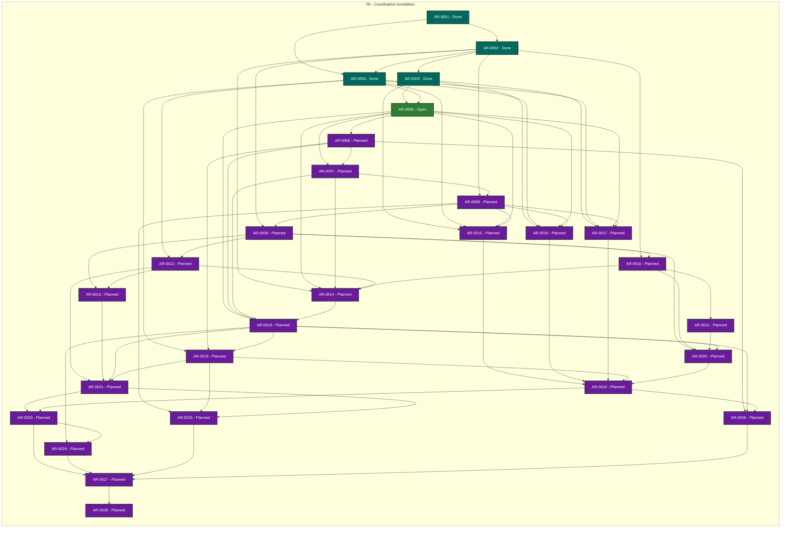

# Agent Workflow Runtime status

> Generated deterministically from task front matter. Do not edit this file directly.
> Status records coordination progress; it is not evidence that product behavior is accepted.

## Portfolio overview

**28 ARs tracked** across 3 active status categories.

| Status | Meaning | Count |
| --- | --- | ---: |
| **In progress** | Claimed work with a live lease | 0 |
| **Open** | Dependency-ready and available to claim | 1 |
| **Blocked** | Cannot proceed until its recorded blocker clears | 0 |
| **Planned** | Defined work awaiting promotion or dependencies | 23 |
| **Future** | Deferred roadmap work | 0 |
| **Done** | Accepted, integrated, and durably verified | 4 |
| **Cancelled** | Stopped with a recorded rationale | 0 |
| **Superseded** | Replaced by another AR | 0 |

## Dependency graph

Arrows point from each prerequisite to the work that depends on it. Color is redundant
with the status text inside every node; the tables below are the complete text
alternative.

### Accessible dependency index

| AR | Prerequisites | Dependents |
| --- | --- | --- |
| [AR-0001](tasks/AR-0001.md) | None | [AR-0002](tasks/AR-0002.md), [AR-0004](tasks/AR-0004.md) |
| [AR-0002](tasks/AR-0002.md) | [AR-0001](tasks/AR-0001.md) | [AR-0003](tasks/AR-0003.md), [AR-0004](tasks/AR-0004.md), [AR-0008](tasks/AR-0008.md), [AR-0009](tasks/AR-0009.md), [AR-0010](tasks/AR-0010.md), [AR-0014](tasks/AR-0014.md) |
| [AR-0003](tasks/AR-0003.md) | [AR-0002](tasks/AR-0002.md) | [AR-0005](tasks/AR-0005.md), [AR-0015](tasks/AR-0015.md), [AR-0016](tasks/AR-0016.md), [AR-0017](tasks/AR-0017.md) |
| [AR-0004](tasks/AR-0004.md) | [AR-0001](tasks/AR-0001.md), [AR-0002](tasks/AR-0002.md) | [AR-0005](tasks/AR-0005.md), [AR-0012](tasks/AR-0012.md), [AR-0015](tasks/AR-0015.md), [AR-0016](tasks/AR-0016.md), [AR-0017](tasks/AR-0017.md), [AR-0019](tasks/AR-0019.md) |
| [AR-0005](tasks/AR-0005.md) | [AR-0003](tasks/AR-0003.md), [AR-0004](tasks/AR-0004.md) | [AR-0006](tasks/AR-0006.md), [AR-0007](tasks/AR-0007.md), [AR-0014](tasks/AR-0014.md), [AR-0015](tasks/AR-0015.md), [AR-0016](tasks/AR-0016.md), [AR-0017](tasks/AR-0017.md), [AR-0018](tasks/AR-0018.md) |
| [AR-0006](tasks/AR-0006.md) | [AR-0005](tasks/AR-0005.md) | [AR-0007](tasks/AR-0007.md), [AR-0018](tasks/AR-0018.md), [AR-0019](tasks/AR-0019.md), [AR-0026](tasks/AR-0026.md) |
| [AR-0007](tasks/AR-0007.md) | [AR-0005](tasks/AR-0005.md), [AR-0006](tasks/AR-0006.md) | [AR-0008](tasks/AR-0008.md), [AR-0014](tasks/AR-0014.md), [AR-0018](tasks/AR-0018.md) |
| [AR-0008](tasks/AR-0008.md) | [AR-0002](tasks/AR-0002.md), [AR-0007](tasks/AR-0007.md) | [AR-0009](tasks/AR-0009.md), [AR-0015](tasks/AR-0015.md), [AR-0016](tasks/AR-0016.md), [AR-0017](tasks/AR-0017.md), [AR-0025](tasks/AR-0025.md) |
| [AR-0009](tasks/AR-0009.md) | [AR-0002](tasks/AR-0002.md), [AR-0008](tasks/AR-0008.md) | [AR-0010](tasks/AR-0010.md), [AR-0012](tasks/AR-0012.md), [AR-0013](tasks/AR-0013.md), [AR-0020](tasks/AR-0020.md) |
| [AR-0010](tasks/AR-0010.md) | [AR-0002](tasks/AR-0002.md), [AR-0009](tasks/AR-0009.md) | [AR-0011](tasks/AR-0011.md), [AR-0014](tasks/AR-0014.md), [AR-0020](tasks/AR-0020.md) |
| [AR-0011](tasks/AR-0011.md) | [AR-0010](tasks/AR-0010.md) | [AR-0020](tasks/AR-0020.md) |
| [AR-0012](tasks/AR-0012.md) | [AR-0004](tasks/AR-0004.md), [AR-0009](tasks/AR-0009.md) | [AR-0013](tasks/AR-0013.md), [AR-0014](tasks/AR-0014.md), [AR-0021](tasks/AR-0021.md) |
| [AR-0013](tasks/AR-0013.md) | [AR-0009](tasks/AR-0009.md), [AR-0012](tasks/AR-0012.md) | [AR-0021](tasks/AR-0021.md) |
| [AR-0014](tasks/AR-0014.md) | [AR-0002](tasks/AR-0002.md), [AR-0005](tasks/AR-0005.md), [AR-0007](tasks/AR-0007.md), [AR-0010](tasks/AR-0010.md), [AR-0012](tasks/AR-0012.md) | [AR-0018](tasks/AR-0018.md) |
| [AR-0015](tasks/AR-0015.md) | [AR-0003](tasks/AR-0003.md), [AR-0004](tasks/AR-0004.md), [AR-0005](tasks/AR-0005.md), [AR-0008](tasks/AR-0008.md) | [AR-0022](tasks/AR-0022.md) |
| [AR-0016](tasks/AR-0016.md) | [AR-0003](tasks/AR-0003.md), [AR-0004](tasks/AR-0004.md), [AR-0005](tasks/AR-0005.md), [AR-0008](tasks/AR-0008.md) | [AR-0022](tasks/AR-0022.md) |
| [AR-0017](tasks/AR-0017.md) | [AR-0003](tasks/AR-0003.md), [AR-0004](tasks/AR-0004.md), [AR-0005](tasks/AR-0005.md), [AR-0008](tasks/AR-0008.md) | [AR-0022](tasks/AR-0022.md) |
| [AR-0018](tasks/AR-0018.md) | [AR-0005](tasks/AR-0005.md), [AR-0006](tasks/AR-0006.md), [AR-0007](tasks/AR-0007.md), [AR-0014](tasks/AR-0014.md) | [AR-0019](tasks/AR-0019.md), [AR-0020](tasks/AR-0020.md), [AR-0021](tasks/AR-0021.md), [AR-0024](tasks/AR-0024.md), [AR-0026](tasks/AR-0026.md) |
| [AR-0019](tasks/AR-0019.md) | [AR-0004](tasks/AR-0004.md), [AR-0006](tasks/AR-0006.md), [AR-0018](tasks/AR-0018.md) | [AR-0021](tasks/AR-0021.md), [AR-0022](tasks/AR-0022.md), [AR-0025](tasks/AR-0025.md) |
| [AR-0020](tasks/AR-0020.md) | [AR-0009](tasks/AR-0009.md), [AR-0010](tasks/AR-0010.md), [AR-0011](tasks/AR-0011.md), [AR-0018](tasks/AR-0018.md) | [AR-0022](tasks/AR-0022.md) |
| [AR-0021](tasks/AR-0021.md) | [AR-0012](tasks/AR-0012.md), [AR-0013](tasks/AR-0013.md), [AR-0018](tasks/AR-0018.md), [AR-0019](tasks/AR-0019.md) | [AR-0023](tasks/AR-0023.md), [AR-0025](tasks/AR-0025.md) |
| [AR-0022](tasks/AR-0022.md) | [AR-0015](tasks/AR-0015.md), [AR-0016](tasks/AR-0016.md), [AR-0017](tasks/AR-0017.md), [AR-0019](tasks/AR-0019.md), [AR-0020](tasks/AR-0020.md) | [AR-0023](tasks/AR-0023.md), [AR-0026](tasks/AR-0026.md) |
| [AR-0023](tasks/AR-0023.md) | [AR-0021](tasks/AR-0021.md), [AR-0022](tasks/AR-0022.md) | [AR-0024](tasks/AR-0024.md), [AR-0027](tasks/AR-0027.md) |
| [AR-0024](tasks/AR-0024.md) | [AR-0018](tasks/AR-0018.md), [AR-0023](tasks/AR-0023.md) | [AR-0027](tasks/AR-0027.md) |
| [AR-0025](tasks/AR-0025.md) | [AR-0008](tasks/AR-0008.md), [AR-0019](tasks/AR-0019.md), [AR-0021](tasks/AR-0021.md) | [AR-0027](tasks/AR-0027.md) |
| [AR-0026](tasks/AR-0026.md) | [AR-0006](tasks/AR-0006.md), [AR-0018](tasks/AR-0018.md), [AR-0022](tasks/AR-0022.md) | [AR-0027](tasks/AR-0027.md) |
| [AR-0027](tasks/AR-0027.md) | [AR-0023](tasks/AR-0023.md), [AR-0024](tasks/AR-0024.md), [AR-0025](tasks/AR-0025.md), [AR-0026](tasks/AR-0026.md) | [AR-0028](tasks/AR-0028.md) |
| [AR-0028](tasks/AR-0028.md) | [AR-0027](tasks/AR-0027.md) | None |

## Complete AR inventory

### Open (1)

| Priority | AR | Owner | Summary | Next action |
| --- | --- | --- | --- | --- |
| P0 | [AR-0005](tasks/AR-0005.md): Supervisor admission, lease, and worker lifecycle | Unclaimed | Define admission, leases, heartbeats, cancellation, handoff, stale-worker recovery, and lifecycle state transitions. | Write and check the versioned specification, then implement only after review. |

### Planned (23)

| Priority | AR | Owner | Summary | Next action |
| --- | --- | --- | --- | --- |
| P0 | [AR-0006](tasks/AR-0006.md): Resource, timeout, and process containment contract | Unclaimed | Define bounded CPU, memory, disk, network, process-tree, timeout, and cancellation behavior with fail-closed enforcement. | Write and check the versioned specification, then implement only after review. |
| P0 | [AR-0007](tasks/AR-0007.md): Checkpoint, interruption, and crash recovery | Unclaimed | Define durable checkpoints, restart safety, idempotence, replay, interruption, and recovery after host or agent failure. | Write and check the versioned specification, then implement only after review. |
| P0 | [AR-0008](tasks/AR-0008.md): Privacy-safe event journal and provenance | Unclaimed | Define the redacted journal, provenance chain, retention, digesting, and public-safe evidence projection. | Write and check the versioned specification, then implement only after review. |
| P0 | [AR-0009](tasks/AR-0009.md): AWQ evidence bridge | Unclaimed | Define the runtime contract for submitting evidence to Agent Workflow Quality and consuming quality gates without duplicating quality authority. | Write and check the versioned specification, then implement only after review. |
| P0 | [AR-0010](tasks/AR-0010.md): AWG oracle bridge and discussion admission | Unclaimed | Define when uncertainty becomes a batched oracle discussion, how alternatives and confidence are recorded, and how final guidance is bound to revisions. | Write and check the versioned specification, then implement only after review. |
| P0 | [AR-0011](tasks/AR-0011.md): UI session bridge and safe resume | Unclaimed | Define the runtime-facing contract for revision-bound interactive discussions, resumable sessions, safe exit, and validated final events. | Write and check the versioned specification, then implement only after review. |
| P0 | [AR-0012](tasks/AR-0012.md): Git, branch, and pull-request publication bridge | Unclaimed | Define safe branch, commit, review, merge, and publication operations with exact-head and signed-DCO evidence. | Write and check the versioned specification, then implement only after review. |
| P0 | [AR-0013](tasks/AR-0013.md): CI and external-observation adapter | Unclaimed | Define how hosted checks and remote observations are requested, correlated, verified, and distinguished from local qualification. | Write and check the versioned specification, then implement only after review. |
| P0 | [AR-0014](tasks/AR-0014.md): Formal runtime models and hostile trace corpus | Unclaimed | Define executable models and adversarial traces covering lifecycle, oracle, recovery, publication, and authority invariants. | Write and check the versioned specification, then implement only after review. |
| P1 | [AR-0015](tasks/AR-0015.md): Codex-compatible reference adapter | Unclaimed | Implement a provider adapter against the normalized contract for a Codex-style agent session, with capability discovery and replay fixtures. | Write and check the versioned specification, then implement only after review. |
| P1 | [AR-0016](tasks/AR-0016.md): OpenCode-compatible adapter | Unclaimed | Implement a provider adapter for an OpenCode-style agent session without leaking provider-specific policy into the runtime core. | Write and check the versioned specification, then implement only after review. |
| P1 | [AR-0017](tasks/AR-0017.md): OpenDesk-compatible adapter | Unclaimed | Implement a provider adapter for an OpenDesk-style agent session with explicit unsupported-capability behavior. | Write and check the versioned specification, then implement only after review. |
| P1 | [AR-0018](tasks/AR-0018.md): Supervisor implementation | Unclaimed | Implement admission, leases, supervision, cancellation, recovery, and lifecycle evidence using the approved formal model. | Write and check the versioned specification, then implement only after review. |
| P1 | [AR-0019](tasks/AR-0019.md): Capability broker and worktree enforcement | Unclaimed | Implement capability grants, tool boundaries, isolated worktrees, project bindings, and fail-closed enforcement. | Write and check the versioned specification, then implement only after review. |
| P1 | [AR-0020](tasks/AR-0020.md): Evidence and oracle bridge implementation | Unclaimed | Implement AWQ evidence submission and AWG batched oracle interaction with revision-bound decisions and reusable guidance. | Write and check the versioned specification, then implement only after review. |
| P1 | [AR-0021](tasks/AR-0021.md): Publication and CI implementation | Unclaimed | Implement signed-DCO publication, review/merge handoff, CI correlation, and exact-head verification. | Write and check the versioned specification, then implement only after review. |
| P1 | [AR-0022](tasks/AR-0022.md): Adapter conformance and replay harness | Unclaimed | Implement cross-adapter conformance tests, deterministic replay, hostile inputs, and capability mismatch reporting. | Write and check the versioned specification, then implement only after review. |
| P1 | [AR-0023](tasks/AR-0023.md): End-to-end autonomous development workflow | Unclaimed | Integrate planning, execution, quality, oracle discussion, review, merge, recovery, and durable state into one bounded workflow. | Write and check the versioned specification, then implement only after review. |
| P1 | [AR-0024](tasks/AR-0024.md): Operational CLI, configuration, and onboarding | Unclaimed | Provide a documented operator interface for setup, run, observe, resume, diagnose, and safe shutdown. | Write and check the versioned specification, then implement only after review. |
| P1 | [AR-0025](tasks/AR-0025.md): Security, privacy, and supply-chain assurance | Unclaimed | Qualify secret handling, least privilege, dependency provenance, redaction, public evidence, and hostile boundary cases. | Write and check the versioned specification, then implement only after review. |
| P1 | [AR-0026](tasks/AR-0026.md): Performance and reliability qualification | Unclaimed | Measure bounded latency, throughput, recovery, resource use, and failure behavior against explicit specifications. | Write and check the versioned specification, then implement only after review. |
| P1 | [AR-0027](tasks/AR-0027.md): Fresh-clone release and compatibility lock | Unclaimed | Prove reproducible installation, clean-checkout operation, compatibility declarations, release evidence, and rollback. | Write and check the versioned specification, then implement only after review. |
| P1 | [AR-0028](tasks/AR-0028.md): Umbrella integration and maintenance workflow | Unclaimed | Register the runtime in the Agent Workflow family and define its ongoing Coordinator, AWQ, AWG, UI, release, and self-evolution workflow. | Write and check the versioned specification, then implement only after review. |

### Done (4)

| Priority | AR | Owner | Summary | Next action |
| --- | --- | --- | --- | --- |
| P0 | [AR-0001](tasks/AR-0001.md): Runtime scope, authority boundaries, and formal specification admission | Unclaimed | Establish the runtime charter, authority matrix, and admission rule that every design or conceptual decision is a versioned, machine-checkable specification before implementation. | Write and check the versioned specification, then implement only after review. |
| P0 | [AR-0002](tasks/AR-0002.md): Versioned normalized session-event protocol | Unclaimed | Define the provider-neutral event envelope, ordering, correlation, revision binding, and compatibility rules for agent execution. | Write and check the versioned specification, then implement only after review. |
| P0 | [AR-0003](tasks/AR-0003.md): Agent adapter capability and lifecycle contract | Unclaimed | Define the adapter contract for heterogeneous agent CLIs, including discovery, start, interaction, termination, failure, and capability reporting. | Write and check the versioned specification, then implement only after review. |
| P0 | [AR-0004](tasks/AR-0004.md): Worktree, project binding, and capability boundary | Unclaimed | Define how a runtime session is bound to a project, exact revision, isolated worktree, allowed tools, and authority boundaries. | Write and check the versioned specification, then implement only after review. |
